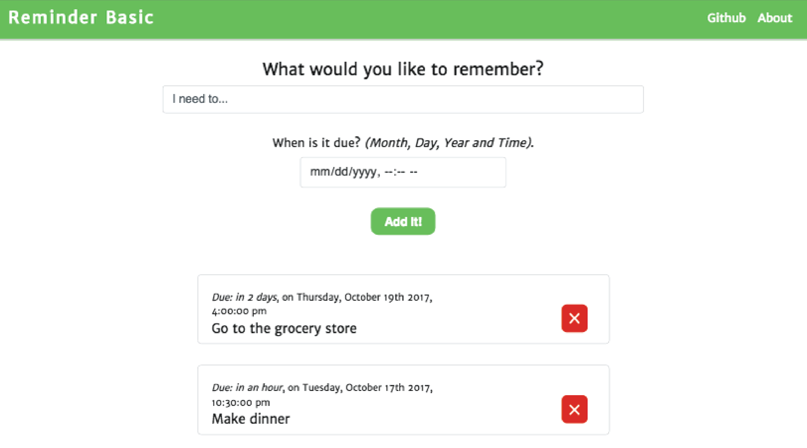
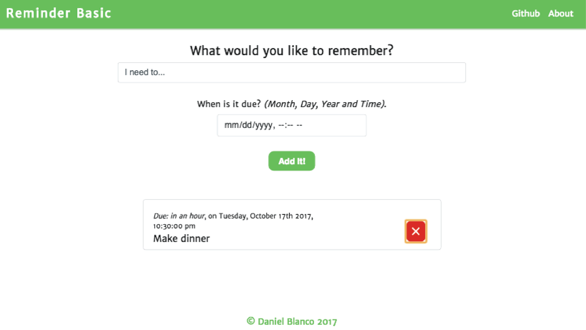

# reminder-react-redux

A CRUD web application built with React and Redux. The user can create and delete reminders from a list and render the changes to the DOM. This application stores the reminders in the users browser using cookies.

## Technologies used:

- HTML5
- CSS3
- Javascript
- Node JS

## Dependencies:
- React JS
- Redux
- SASS
- Webpack
- Babel
- bootstrap
- css-loader
- express
- moment
- react
- react-addons-css-transition-group
- react-addons-transition-group
- react-dom
- react-redux
- react-router
- react-scripts
- reactstrap
- redux
- request
- sass-loader
- sfcookies
- style-loader

## Version

1.0

## Usage

#### The user starts on the only page in the application.

#### The user then enters a reminder and a date for it to be completed.

#### The reminder gets added to the DOM.

#### The user can add multiple reminders. Since the reminders are stored in the users browser as cookies, the reminders will remain after a page refresh.

#### Reminders can also be deleted by clicking the red x on the right hand side.

### Link to the live site

https://reminder-basic.herokuapp.com/
